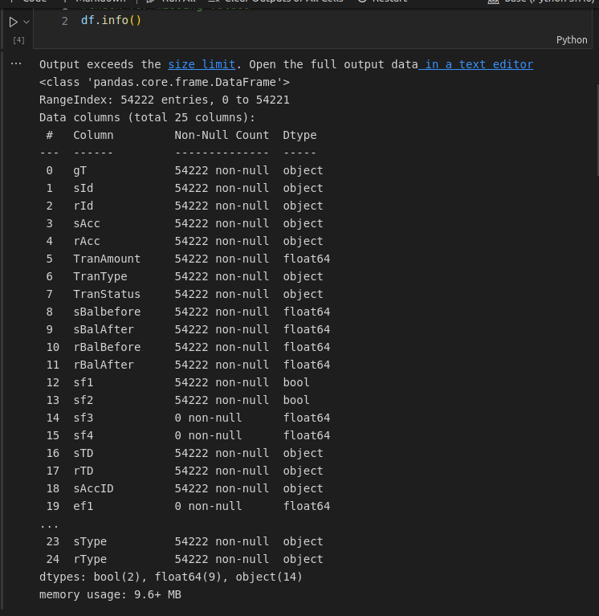
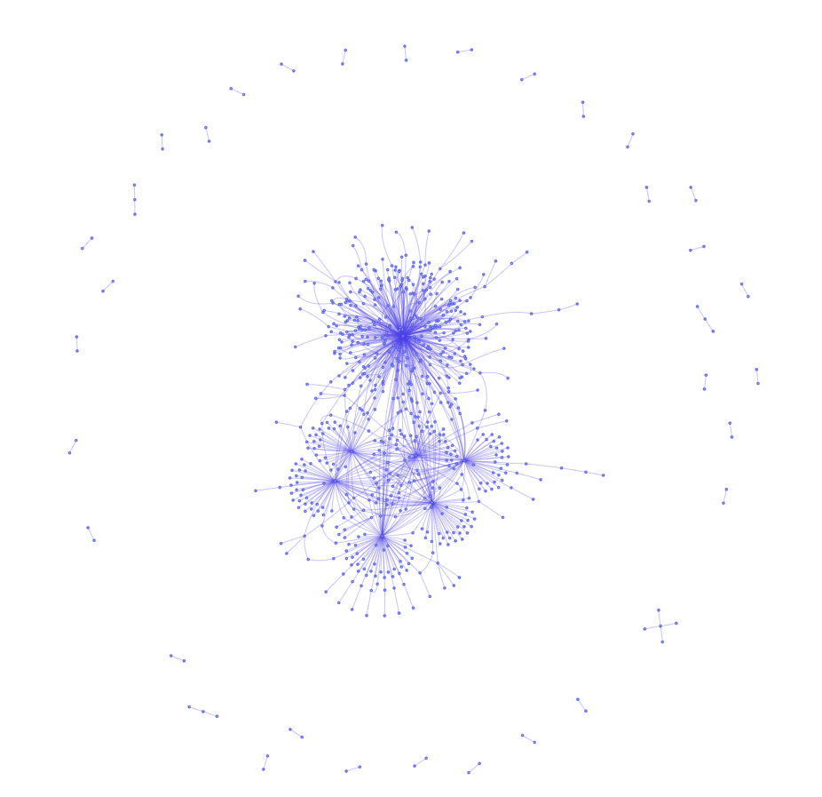
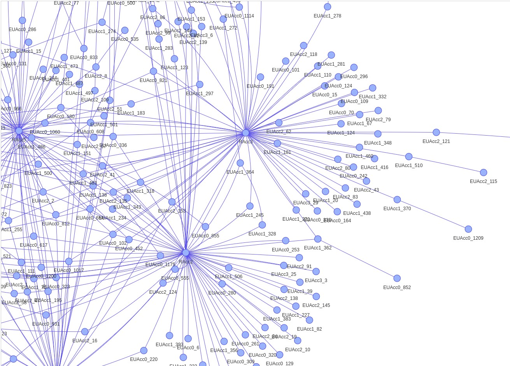
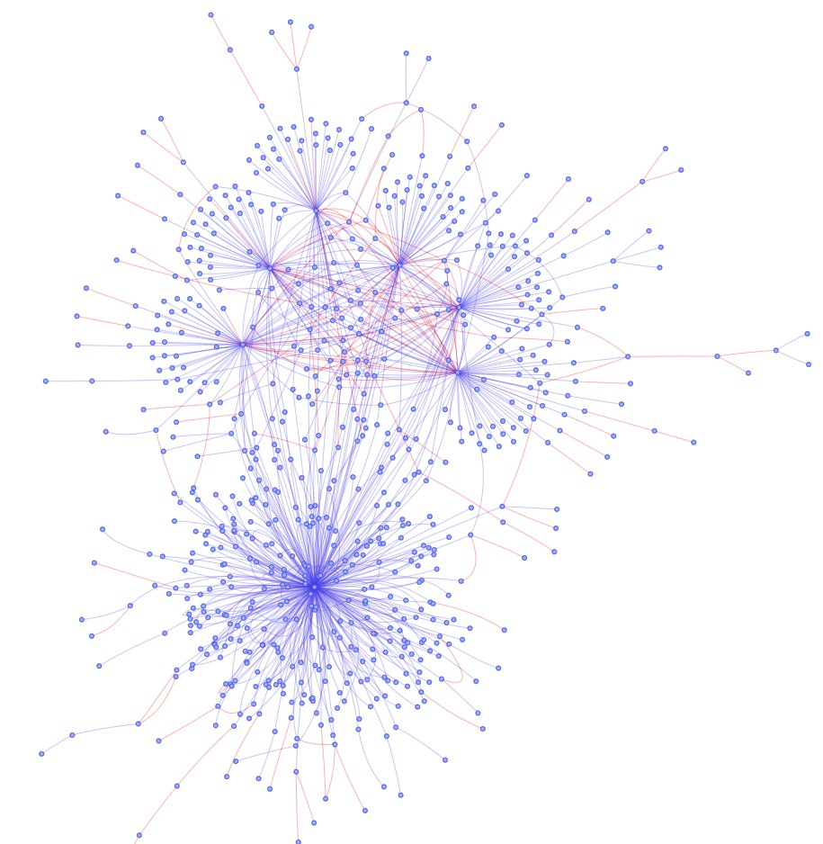

## Detection of Fradulent Transactions by Graphical Analysis
## Problem Statement:

A dataset containing finacial transactions between bank customers are given. Main task is to find out the fraud transactions using visualization techniquies only (without using any machine learning algorithm).

## Dataset characteristics:
- The dataset is artificially created for Visual Analytics research purposes. It contains categorical, numerical and time series data.

- Number of raw features = 25
- Number of samples = 54222

## Used technologies and concepts.
**Programming language**: Python. 

**Method:** Visual analysis using network graphs.

**Used libraries**: numpy, pandas, matplotlib, seaborn, networkx, pyvis-Network

> To install network and pyvis
```
pip install networkx

pip install pyvis
```
**Conceptual idea to detects fraud transactions:**

Based on the criteria mentioned in the paper [1][##Reference], following facts are considered to detect a possible fraud transaction
- The amount of fraudulent transactions is smaller than the average amount of transaction by all users.

- The mules can perform legitimate transactions but a sudden change in transfered money amounts corresponds to an anomaly.

- An account holder that did several transactions for individual or withdrawal purpose with an amount lower than average amount of transaction can be considered as a fraudster and the respective transactions as fraud transactions.

Based on these criteria fradulent transactions  are segregated.

## Solution to the task
The entire dataset is analysed in 3 steps
### 1. Data Set Preparation

The dataset was intially in (_.txt) format ([RawDataset](logsDataset.txt)). For convinent use, it is converted into (_.csv) format ([Data in CSV format](TransactionSamples.csv)) using pandas library. [Code to transfer the data](transfer_theData.ipynb).

### 2. Data cleaning and Exploratory data analysis.



The raw dataset had 25 feature columns and 54222 samples. During data preprocessing it has been found that, in the raw dataset
- There are total 14 categorical, 2 boolean and 9 numerical features.
-Service fields 3 and Service field 4 are empty.
- There are another 2 empty fields.
-There is column (column 22) with no description but it has samples.
- Column 23 ( Transaction Time and date) and column 16 have the same data.
-Column 19 and column 4 have the same data about sender Account ID.
So these columns were removed. 

Except these there are no missing values in any column. And the
processed data set have total 19 columns.

[Cleaned Dataset](processedData1.csv)

[File for data cleaning](DataCleaning.ipynb)

### 3. Exploratory Data Analysis

### 4. Graphical analysis for fraud detection
We can visualize the fraud transactions if we can represent all the transactions as a graph network, where 

node of the graph = Account Id(Account holder)

edge = A transaction. 

edge length = Amount of transaction.

An edge connects the sender and receiver of a transaction.

### Step 1:
All the transactions are visualized as a graph network.

#### Below is the graphical representation of all the transactions.



A detailed view of the transactions.



### Step 2:

In the created graph network a node either represents a ‘sender account id’ or a ‘receiver account id’ So the nodes with higher degree represents the accounts that did maximum transactions. After finding the mostly used accounts samples are segregated according to the method [1,2] to find fraud transactions.

[File to segregate fraud transactions](GraphicalAnalysis.ipynb)

### Step 3:
Normal transactions are visualised in blue color and possible fraud transactions are visualized in red color in the final graph network.




### 5. Colclusion
Out of total 54222 transactions 3614 transactions are suspected to be fraud transaction.

## Reference  
[1] Evgenia Novikova, Igor Kotenko and Evgenii Fedotov. Interactive Multi-View Visualization for
Fraud Detection in Mobile MoneyTransfer Services, International Journal of Mobile Computing
and Multimedia Communications, 6(4), 73-97, October-December 2014.

[2] Rieke, R., Zhdanova, M., Repp, J., Giot, R., & Gaber, C. (2013). Fraud Detection in Mobile
Payments Utilizing Process Behavior Analysis. The 2nd International Workshop on Recent
Advances in Security, Information and Event Management (RaSIEM 2013) (pp. 662-669). New
York: IEEE.


**Note:**
- This was my final assignment for the subject 'Data and Visual Analytics' in 3rd semester of my master degree. I passed the assignment with this solution and was given highest mark out of 13 students in the class.
- For any mistakes or for any suggestion to improve feel free to contact me. [Email](getssultan@gmail.com)
